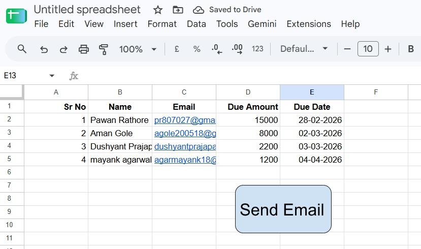
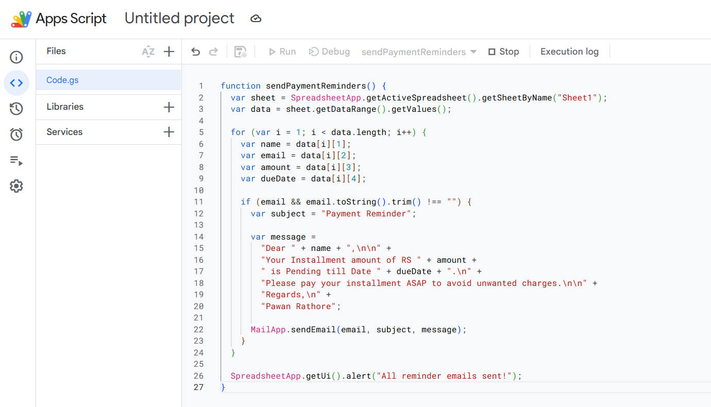
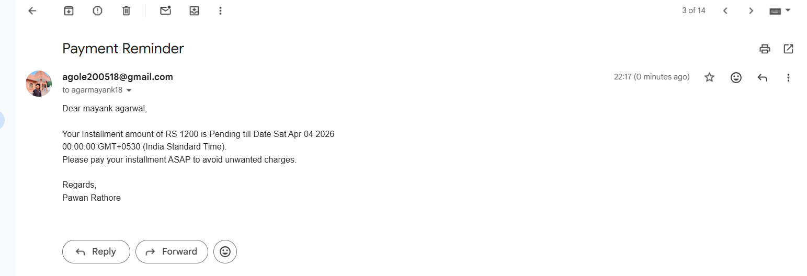
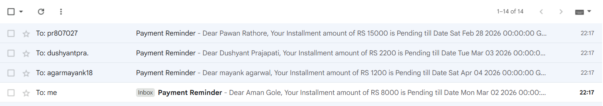

# 📧 Google Sheets Payment Reminder Automation

Automated payment reminder system using **Google Sheets, Google Apps Script & Gmail**.

## 🚀 Features

* 📊 Google Sheets based payment data
* 📧 Automated reminder emails
* 🖱️ One-click **SEND EMAIL** button
* 👤 Personalized customer emails
* 💰 Dynamic due amount
* 📅 Dynamic due date
* 🔄 Bulk email sending

## ⚙️ How It Works

```text
Google Sheets → Apps Script → Gmail → Payment Reminder
```

The script reads **Name, Email, Due Amount and Due Date** from `Sheet1` and sends a personalized payment reminder.

## 📊 Google Sheet

**Add your screenshot here:**



## 💻 Apps Script

**Add your screenshot here:**



## 📧 Email Output

**Add your screenshot here:**

 

## 🛠️ Tech Stack

* Google Sheets
* Google Apps Script
* JavaScript
* Gmail MailApp


## 🔮 Future Improvements

* Automatic daily reminders
* Payment status tracking
* Duplicate email prevention
* Overdue payment detection
* HTML email templates

## 👨‍💻 Author

**Aman Gole**

🔗 [LinkedIn](https://www.linkedin.com/in/aman-gole-it125)

---

⭐ If you like this project, consider giving it a star!
